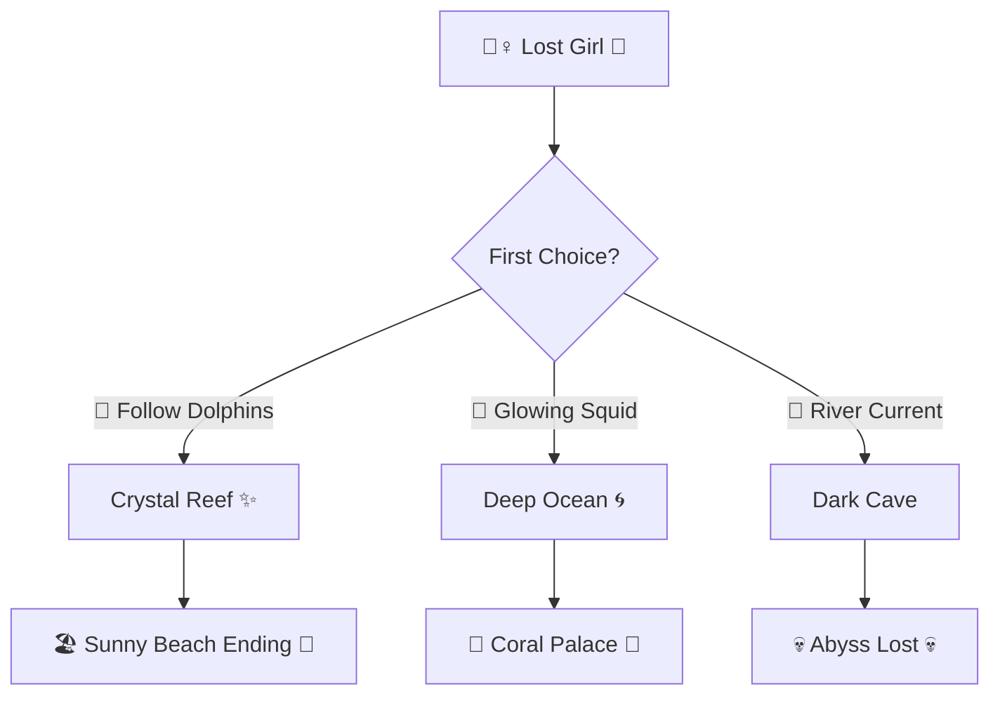

<h1>🌊🧜‍♀️ Sea Drifter 🧜‍♀️🌊</h1>


<div align="center">


[](https://git.io/typing-svg)


</div>

---

<div align="center">


**🧜‍♀️ An interactive branching story game about a lost little girl**
**trying to find her way home through whispering waves and coral mazes.**

> *"Swim with the currents, find your destiny!"* 🐬


</div>

---

<div align="center">


<br/>

| 🌿 Feature | 🎭 What It Does |
|:---:|:---|
| 🌿 **Branching Paths** | Every choice splits the current — no two playthroughs are the same |
| 🎭 **3 Distinct Endings** | Sunny Beach 🏖️ · Coral Palace 🏰 · The Abyss ⚫ |
| 📜 **Path Log** | Scrolling record of every decision you made |
| 🔄 **Restart Magic** | Instant reset — dive back in immediately |
| 🐬 **Dolphin Guidance** | Choices feel natural, not forced |
| 💎 **Sea Treasures** | Collectibles hidden along each path |
| 🧠 **Journey Tracker** | Visual map of where you've been |
| ⚡ **Zero Load Time** | Pure HTML/CSS/JS — opens instantly |

</div>

<div align="center">

</div>

---

<div align="center">




</div>

---

<div align="center">


</div>

**🐚 Clone the Depths:**
```bash
git clone https://github.com/DaCameraGirl/lost-little-girl-paths.git
cd lost-little-girl-paths
```

**🌊 Open the Portal:**
```bash
# Option 1 — just double-click index.html 🧜‍♀️
# Option 2 — serve locally:
python -m http.server 8080
```

**🌀 Play & Replay Forever! ✨**

---

<div align="center">


<br/>


**🧜‍♀️ Made with Ocean Magic 💙 by [DaCameraGirl](https://github.com/DaCameraGirl) 🧠✨**

*"Lost paths lead to found treasures... 🌊🐚"*


🌊🧜‍♀️🐚🐟🐳🐙🦀🐡🐬🦈✨💎🌀🌊🧜‍♀️🐚🐟🐳🐙🦀🐡🐬🦈✨💎🌀🌊

</div>
