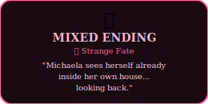
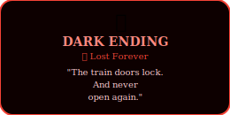
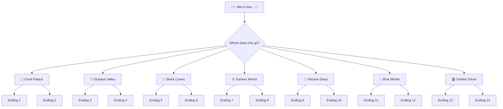

<h1>🌊🧜‍♀️ Pick — The Sunken Tale 🧜‍♀️🌊</h1>


<div align="center">




[](https://git.io/typing-svg)


</div>

---

<div align="center">


**🧜‍♀️ A choose-your-own-adventure mermaid story game**
**made with love for Jaxon — an autistic 8-year-old who loves numbers.**

> *"Swim with the currents, find your destiny!"* 🐬


</div>

---

## 🧠 Why This Exists

I built this for my son **Jaxon**, who is 8 years old, autistic, and absolutely loves numbers. He wanted a mermaid story — but he also wanted it to have maths in it. So every scene in the game has real ocean number facts woven through it.

Things like:
- *"8 arms × 240 suckers = 1,920 suckers on one octopus!"*
- *"Blue whales sing at 188 decibels — louder than a jet engine!"*
- *"7 is a prime number — only divisible by 1 and 7 itself!"*

The **Read to Me** button was added so he can have it read aloud while he follows along.

**Jaxon tested every ending. He counted his way through all of them.**

---

<div align="center">






<br/>

| 🌿 Feature | 🎭 What It Does |
|:---:|:---|
| 🌊 **7 Story Paths** | Coral Palace · Octopus Valley · Shark Caves · Sunken Wreck · Volcano Deep · Blue Whale · Golden Shore |
| 🎭 **14 Unique Endings** | Two deeper choices per path — completely different outcomes each time |
| 🔊 **Read to Me** | One-tap text-to-speech reads every scene aloud — built for accessibility |
| 🧮 **Jaxon's Fact Book** | Collects real number facts as you play — 65 facts hidden across all 21 scenes |
| 📜 **Pick Log** | Scrolling record of every choice you made in this run |
| 🔄 **Restart Magic** | Instant reset — dive back in and find new paths |
| 🧜‍♀️ **Jaxon Cameos** | At every good ending, Jaxon appears on the shore — always counting something |
| ⚡ **Zero Load Time** | Pure HTML/CSS/JS — no install, no login, opens instantly |

</div>

<div align="center">

</div>

---

<div align="center">




</div>

---

<div align="center">


</div>

**▶️ Play instantly online:**

👉 **[dacameragirl.github.io/sea-drifter](https://dacameragirl.github.io/sea-drifter/)**

**🐚 Or clone locally:**
```bash
git clone https://github.com/DaCameraGirl/sea-drifter.git
cd sea-drifter
```

**🌊 Open the Portal:**
```bash
# Option 1 — just double-click index.html 🧜‍♀️
# Option 2 — serve locally:
python -m http.server 8080
```

**🌀 Play & Replay Forever! ✨**

---

## 🧮 Jaxon's Fact Book

As you explore each scene, real number facts slide into **Jaxon's Fact Book** — a glowing panel that grows with every path you take. There are **65 facts** across all 21 scenes. You'd need to play every path to find them all.

A few favourites:
> 🐙 *8 arms × 240 suckers = 1,920 suckers on a single octopus!*
> 🌊 *The Mariana Trench is 11 km deep — deeper than Mount Everest is tall!*
> ☀️ *Sunlight takes 8 minutes to travel from the Sun to Earth!*
> 🐋 *Blue whales can live to 100 years old*

---

<div align="center">


<br/>


**🧜‍♀️ Made with Ocean Magic 💙 by [DaCameraGirl](https://github.com/DaCameraGirl) 🧠✨**

*"Lost paths lead to found treasures... 🌊🐚"*


🌊🧜‍♀️🐚🐟🐳🐙🦀🐡🐬🦈✨💎🌀🌊🧜‍♀️🐚🐟🐳🐙🦀🐡🐬🦈✨💎🌀🌊

</div>
